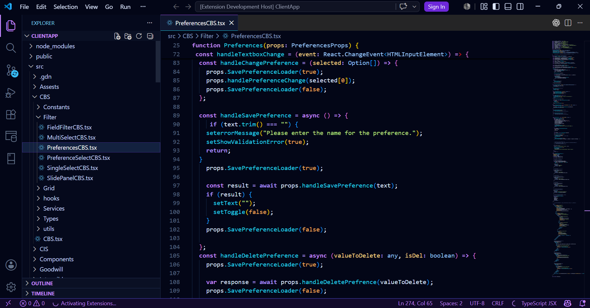
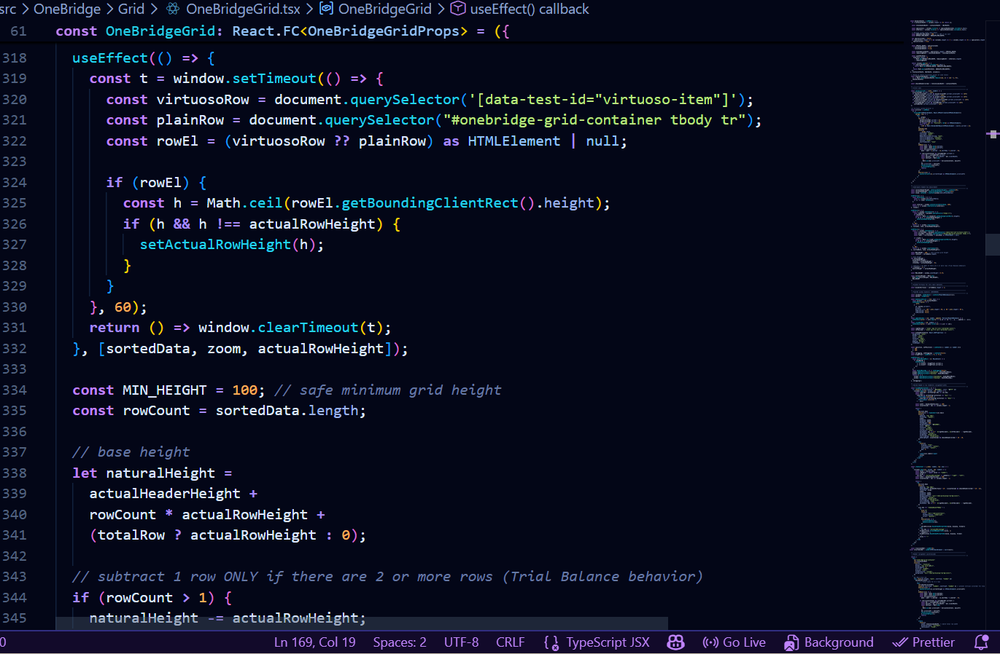
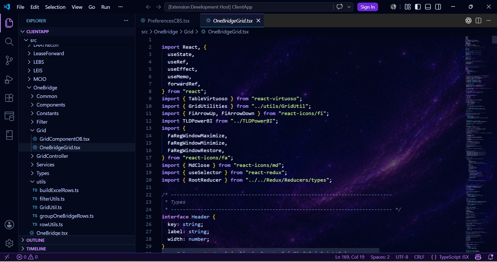

# Midnight React

Built for React Developers Who Live in Dark Mode.

## Features

- Premium midnight dark UI
- React and TSX focused syntax colors
- Strong JSX readability
- Better hooks and function visibility
- Cyan, purple and soft yellow palette
- Clean sidebar, tabs, terminal and status bar styling

## Best For

- React
- TypeScript
- TSX
- JavaScript
- JSX
- Redux
- Next.js

## Installation

1. Open VS Code Extensions
2. Search `Midnight React`
3. Install
4. Open Command Palette (cntrl + shift + p)
5. Select `Preferences: Color Theme`
6. Choose `Midnight React`

## Screenshots

### Main Editor Experience

Premium dark editor experience crafted for React, TypeScript and TSX development with carefully tuned syntax colors, glowing active tabs and improved readability.

---

### React + TSX Experience

Enhanced JSX readability with specially designed colors for hooks, React components, props, functions and TypeScript types.

---

### Optional Galaxy Mode ✨

Midnight React also supports an optional cinematic Galaxy Mode setup for developers who want a more immersive workspace experience.

Galaxy Mode combines:
- transparent glass-style UI
- cosmic galaxy background
- neon purple/cyan glow aesthetics
- premium futuristic developer atmosphere

To enable Galaxy Mode:

1. Install the `Background` VS Code extension
2. Open `Preferences: Open User Settings (JSON)`
3. Add the provided Galaxy Mode configuration from this repository
4. Reload VS Code

